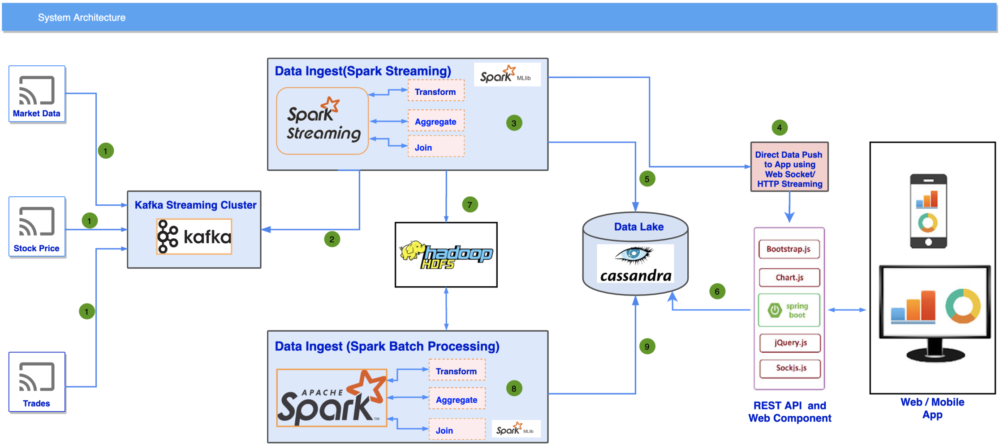

 
This system architecture is designed for real-time and batch data processing in a financial or trading environment. It starts by ingesting data from sources like Market Data, Stock Prices, and Trades into a Kafka Streaming Cluster. From there, the data is processed in real-time using Spark Streaming and stored in a Cassandra data lake or Hadoop HDFS for further use. The architecture supports direct data push to web and mobile apps via WebSockets/HTTP Streaming and provides APIs for interacting with processed data. The front-end leverages technologies like Spring Boot, Bootstrap.js, and Chart.js for responsive user interfaces.

## System Components

### 1. Data Sources
- **Market Data**
- **Stock Prices**
- **Trades**

### 2. Kafka Streaming Cluster
- Acts as the central hub for ingesting data streams from multiple sources.
- Provides scalable, distributed data streaming.

### 3. Data Ingestion
#### Real-Time Processing
- **Apache Spark Streaming** processes the data in real-time.
- Operations: `Transform`, `Aggregate`, `Join`
- Integrated with **Spark MLlib** for machine learning.

#### Batch Processing
- **Apache Spark** handles batch data processing.
- Operations: `Transform`, `Aggregate`, `Join`

### 4. Data Storage
- **Cassandra Data Lake:** Stores processed data, offering high availability and scalability.
- **Hadoop HDFS:** Provides additional distributed storage for large datasets.

### 5. Data Push and API
- **WebSocket/HTTP Streaming:** Directly pushes real-time data to web and mobile applications.
- **REST API:** Enables interaction with processed data using technologies like `Spring Boot`, `Bootstrap.js`, `Chart.js`, `jQuery.js`, and `SockJS.js`.

## Front-End
- Built with **Spring Boot**, **Bootstrap.js**, **Chart.js**, **jQuery.js**, and **SockJS.js**.
- Supports both web and mobile applications with responsive interfaces.

## Key Features
- **Scalability:** Easily handles large volumes of streaming and batch data.
- **Real-Time Processing:** Provides timely updates to applications.
- **High Availability:** Ensured by using distributed systems like Kafka, Cassandra, and Hadoop.

## Use Cases
- Ideal for financial markets, stock trading platforms, and large-scale data analytics.

## Getting Started

### Prerequisites
- **Apache Kafka**
- **Apache Spark**
- **Cassandra**
- **Hadoop HDFS**
- **Spring Boot** for REST APIs and web services

### Installation
1. Set up Kafka for streaming data ingestion.
2. Configure Spark for both streaming and batch processing.
3. Install and configure Cassandra and Hadoop HDFS for data storage.
4. Set up the REST API and front-end components using Spring Boot and related web technologies.

### Running the System
- Start Kafka for data ingestion.
- Initiate Spark Streaming and Batch jobs.
- Push data to the front-end using WebSocket/HTTP Streaming.

## License
This project is licensed under the MIT License.
